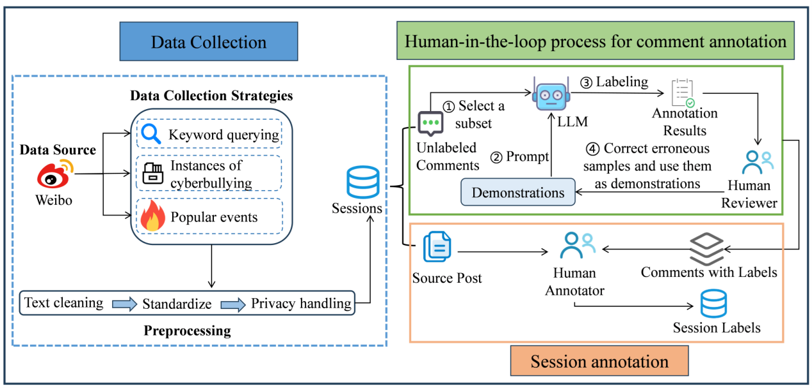
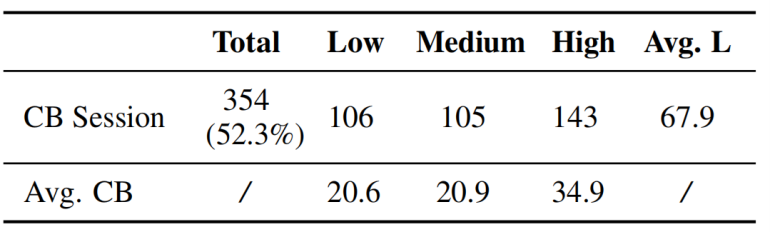
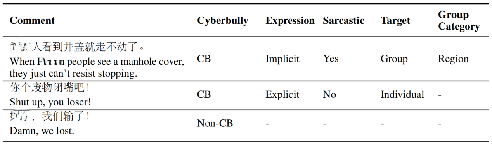

<div align="center">
<h1>SCCD:基于会话的中文网络欺凌检测数据集</h1>
</div>

SCCD是首个**中文**的**基于会话**的网络欺凌数据集，填补了中文网络欺凌研究领域的空白。该数据集旨在为中文网络欺凌检测模型的研发提供了坚实的基础，促进有效的欺凌行为预防与干预措施的设计。

## 最新资讯
🎉[2025-02-09] 相关论文 《SCCD: A Session-based Dataset for Chinese Cyberbullying Detection》 已被COLING 2025接收！

## 数据集构建
我们选择微博作为数据源，采用三种数据收集策略获取会话，以丰富数据集的多样性和代表性。针对每个会话，人工标注是否网络欺凌，若为欺凌，额外标注欺凌程度。针对每个会话的所有评论，我们提出了基于LLM的人在回路标注过程，对每个评论进行了细粒度标注，包括：是否网络欺凌、表达方式（显式或隐式）、是否讽刺、针对个人还是群体、针对的群体类型（性别、地域、种族、LGBTQ）。

<div align="center">

</div>

## 数据集介绍
数据集共包含677个会话，每个会话都被标注为是否网络欺凌，并对欺凌严重程度进行了系统化分级（轻度、中度和重度）。网络欺凌会话占比为52.3%，这意味着数据集是平衡的。

<div align="center">

</div>

677个会话总共包含38999条评论，其中有9805条评论是网络欺凌的。针对网络欺凌评论，我们补充了四个细粒度的标签，弥补了现有研究的局限性。SCCD中有三种类型的评论：针对群体的网络欺凌评论、针对个人的网络欺凌评论和正常评论。

<div align="center">

</div>

**声明：数据集包含有害违规内容示例，均不代表本团队立场。**
## 引用
```bibtex
@article{Yang2025SCCDAS,
  title={SCCD: A Session-based Dataset for Chinese Cyberbullying Detection},
  author={Qingpo Yang and Yakai Chen and Zihui Xu and Yuming Shang and Sanchuan Guo and Xi Zhang},
  journal={ArXiv},
  year={2025},
  volume={abs/2501.15042},
  url={https://api.semanticscholar.org/CorpusID:275821009}
}
```

## 关于我们

STAIR (Secure and Trustworthy AI Research) 团队隶属于北京邮电大学网络空间安全学院和可信分布式计算与服务教育部重点实验室。团队主要研究安全可信人工智能技术，及在网络空间治理领域的应用，近年来在网络内容与行为分析、大模型安全等方面承担了国家重点研发计划等多项重要科研任务。

**联系我们**

zhangx@bupt.edu.cn
